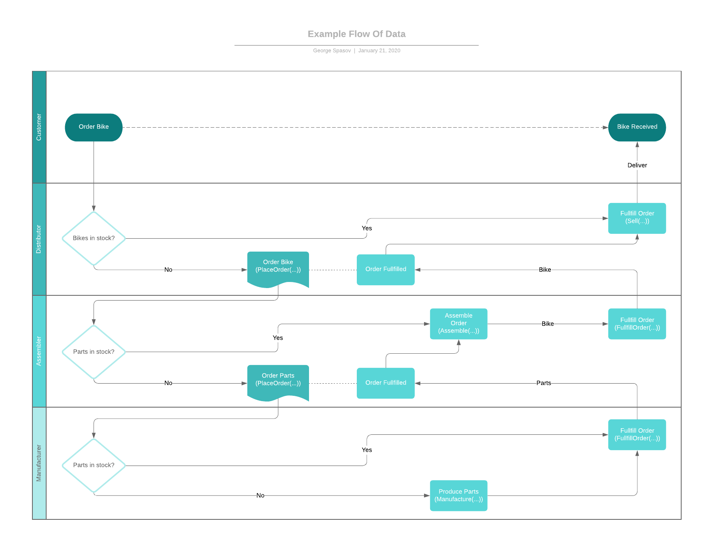
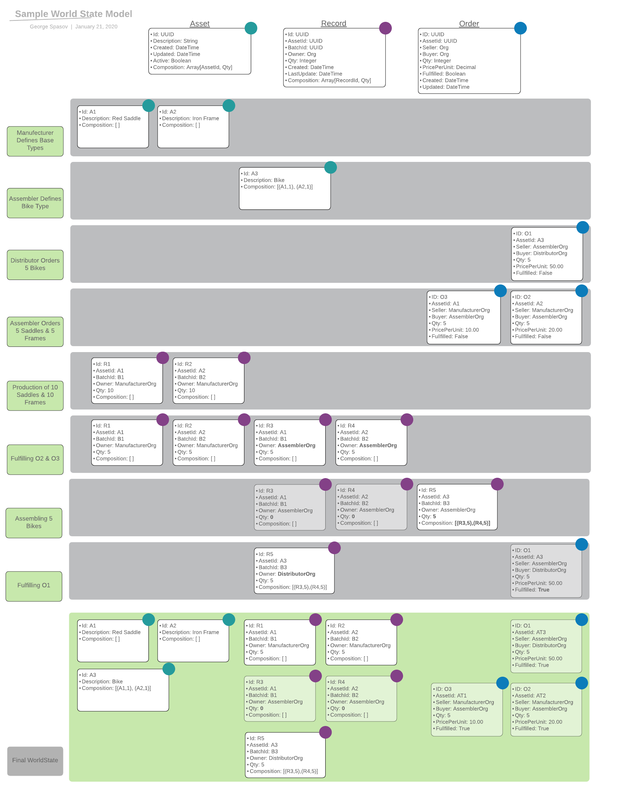

# SupplyKit

## Overview
**SupplyKit** is a library for supply chain based Hyperledger Fabric chaincode development. It provides
abstractions of components which developers can extend in order to make their development process easier.

## Architecture
We have provided abstract definitions of the most general entities of a supply chain. An **Asset** represents
the definition of an item, and **Record** is the actual item with its properties and quantity. An **Order** is
an entity, representing the transfer of records between different organizations.

We have decided to demonstrate a basic supply chain of bikes from their assembly to their distribution to customers.
Functionality is divided between three organizations:
  * Manufacturer - defines non-composable assets and manufactures their records
  * Assembler - buys records from **Manufacturer** and assembles complex assets
  * Distributor - buys records from **Assembler** and sells them to customers

In the examples below, a bike is assembled from two assets - 1 saddle and 1 frame. The **Business Process Flow** diagram
demonstrates the flow of customer ordering a bike from distributor. **World State** diagram shows the world state on
every action until the bikes' distribution.

### Business Process Flow Diagram

### World State Diagram

## Structure

* [chaincodes](cc)
    * [BaseSupplyChainChaincode](cc/BaseSupplyChainChaincode.go) - base chaincode, having the functionality to create records, create orders and fulfill them
    * [AssetBoundChaincode](cc/AssetBoundChaincode.go) - chaincode, having an additional functionality to create assets and extends **BaseSupplyChainChaincode**'s
    creation of records and orders
    * [ComposableChaincode](cc/ComposableChaincode.go) - chaincode, having the functionality to compose a record based on other records and extends **BaseSupplyChainChaincode**'s
    creation of records and orders
    * All **chaincodes** are written in a way that leaves developers decide how they want to store the data in the world state
* [constants](constants) - declarations of constants, used in chaincode development
* [examples](examples) - examples, based on [chaincodes](cc) & [types](types)
* [types](types)
    * [asset](types/asset) - package, storing all asset related structs
    * [dto](types/dto) - package, storing all DTOs
    * [order](types/order) - package, storing all order related structs
    * [record](types/record) - package, storing all record related structs 
* [utils](utils) - helper functions for querying and creating objects

## Examples

## [1. Transparent Supply Chain](examples/transparent-supply-chain)

### Goal
The goal of this example is to prove blockchain can be used for tracking of goods
without the need of external system integration or hidden private data.
It involves only chaincode invocation in order to govern digitalization of
assets, their records, orders, and their state transitions through the supply chain.

### Structure
   * [chaincode](examples/transparent-supply-chain/chaincode.go) - extends both [AssetBoundChaincode](cc/AssetBoundChaincode.go) and [ComposableChaincode](cc/ComposableChaincode.go),
   having the functionality to create assets, records, orders, and functionality to make complex queries and sell records
   * [chaincode_test](examples/transparent-supply-chain/chaincode_test.go) - tests for **chaincode**

## [2. Transparent Supply Chain 2](examples/transparent-supply-chain-2)
Each record has an additional list of quality certificates.

### Structure
   * [certifiedRecord](examples/transparent-supply-chain-2/certifiedRecord.go) - extends both [AssetBoundRecord](types/record/assetBoundRecord.go) and [ComposableRecord](types/record/composableRecord.go)
   * [chaincode](examples/transparent-supply-chain-2/chaincode.go) - extends both [AssetBoundChaincode](cc/AssetBoundChaincode.go) and [ComposableChaincode](cc/ComposableChaincode.go),
   having the functionality to create assets, records, orders, and functionality to make complex queries and sell records
   * [chaincode_test](examples/transparent-supply-chain-2/chaincode_test.go) - tests for **chaincode**

## [3. Privacy Preserving Transparent Supply Chain](examples/privacy-preserving-transparent-supply-chain)

### Goal
The goal of this example is to prove the privacy of sensitive organisational data in real-world scenarios, like, for example, trade secret.
Hyperledger Fabric offers private data functionality, allowing parties of one and the same channel to keep data private between each other without disclosing it
to the rest of the channel.

Instead of storing the order's price in the World State, price will now be stored in a **private data collection** depending on the issuer and distributor of the given order.

We have added restrictions on the allowance of chaincode invocation functions in order to visualize the flow as authentic as possible.

### Structure
   * [chaincode](examples/privacy-preserving-transparent-supply-chain/chaincode.go) - extends both [AssetBoundChaincode](cc/AssetBoundChaincode.go) and [ComposableChaincode](cc/ComposableChaincode.go),
   having the functionality to create assets, records, orders, and functionality to make complex queries and sell records. Chaincode invocation functions are restricted
   to specific organisations. Chaincode stores the orders' price in private data collections.
   * [collections_config](examples/privacy-preserving-transparent-supply-chain/collections_config.json) - list of private data collection definitions.
   * [scripts](examples/privacy-preserving-transparent-supply-chain/scripts) - scripts for **first-network** from [fabric-samples](https://github.com/hyperledger/fabric-samples) to demonstrate
   the process flow.
        * **run_script.sh** - using **cli** from **first-network** - installs chaincode on Org1 & Org2, instantiates chaincode on channel **mychannel**, invokes and queries private data with both organisations.
        * **org3_cli.sh** - using **Org3cli** - installs chaincode and tries to query data from the private data collection of Org1 and Org2

### How to run scripts?
   * Run `byfn.sh -c mychannel -s couchdb` from [first-network](https://github.com/hyperledger/fabric-samples/tree/release-1.4/first-network)
   * Run `eyfn.sh -c mychannel -s couchdb` from [first-network](https://github.com/hyperledger/fabric-samples/tree/release-1.4/first-network)
   * Run `docker exec -it cli bash`
       * Clone this repository: `git clone https://github.com/LimeChain/SupplyChainPOCs.git`
       * Give execution permission to **run_script.sh** (`chmod u+x <path>/run_script.sh`)
       * Install `go` dependencies if not already
       * Run `run_script.sh`
   * Open another terminal
   * After `run_script.sh` has finished successfully, execute `docker exec -it Org3cli bash`
       * Clone again this repository: `git clone https://github.com/LimeChain/SupplyChainPOCs.git`
       * Give execution permission to **org3_cli.sh** (`chmod u+x <path>/org3_cli.sh`)
       * Run `org3_cli.sh`